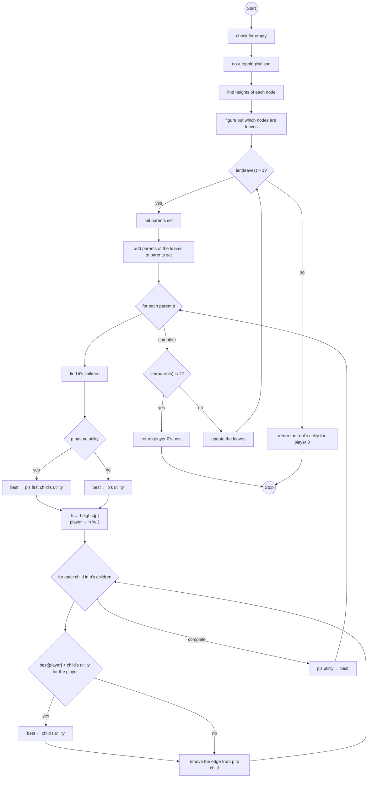

# Adversary

A description of one adversarial search used for this assignment. This flowchart is written in pseudocode so do not expect the statements to align with Python exactly.

## minimax

Note: This is an iterative version of the algorithm. The left arrow (←) means assign to. Consider using `list(nx.topological_sort(G))`, `nx.shortest_path_length(G,sorted[0])`, and `[x for x in G.nodes() if G.out_degree(x)==0 and G.in_degree(x)==1]` as helpful snippets of code. You can access utility using commands like `G.nodes[p]["utility"]`.

## AlphaBeta Pruning

This is something that you can implement as a clever update to minimax. Keep in mind that the given version of minimax removes edges to simplify the graph, but your AlphaBeta should only remove edges when they are pruning from the tree. For a helpful step-by-step guide, visit [https://www.youtube.com/watch?v=xBXHtz4Gbdo](https://www.youtube.com/watch?v=xBXHtz4Gbdo) for an in-dept explanation on an example tree by the folks at Berkeley.
